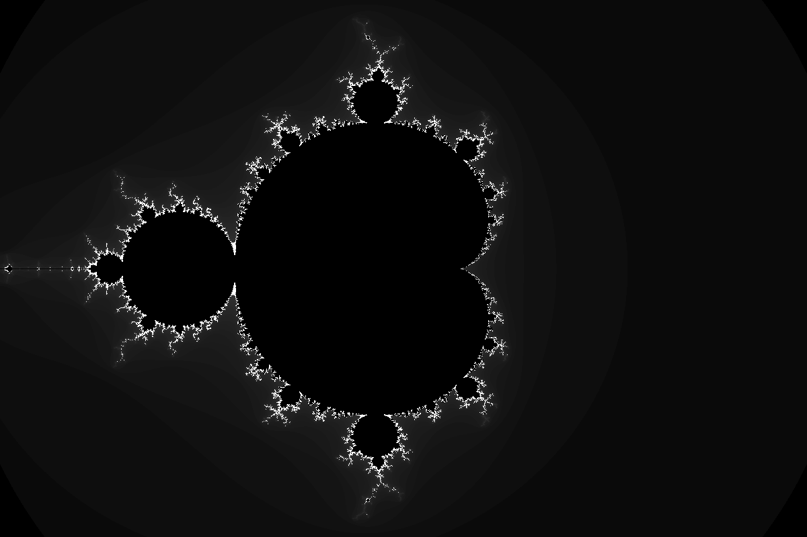
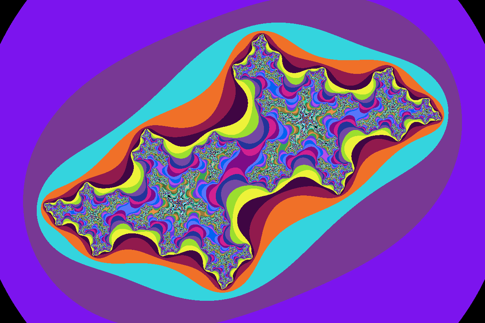

# Discovering Modern C++ solutions

My personal solutions for the book [Discovering Modern C++: An Intensive Course for Scientists, Engineers and Programmers](https://www.amazon.com/Discovering-Modern-Scientists-Programmers-Depth/dp/0134383583) by Peter Gottschling.

## Building 
Most of the files are just a single main so you can compile them as usual. But to build 
all solutions at once, you will need to CMake, please check it out from [here](https://cmake.org/download).


Clone the repo with:
```
git clone https://github.com/p1v0t/DiscoveringModernCppSolutions.git
```
And use generic commands to generate build files with CMake:
```
cmake -S DiscoveringModernCppSolutions -B build 
```
And build with:
```
cmake --build build --parallel 4
```
The executables will be generated on *output* directory 
named by exercise numbers. I put the list of exercises in every chapter in related 
directories, so you can easily navigate.

- An image (Mandelbrot set) generated on exercise 4.8.3



- Cantor dust generated on exercise 4.8.3



